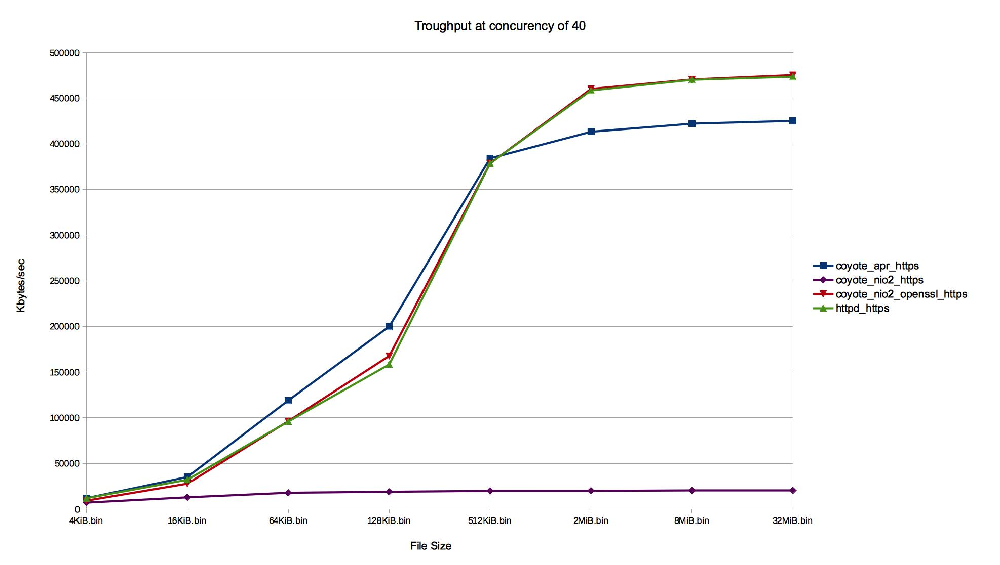
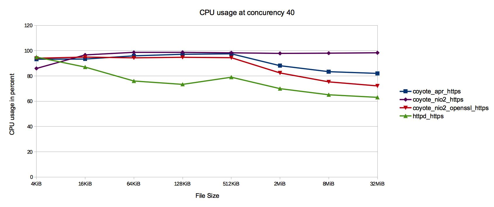
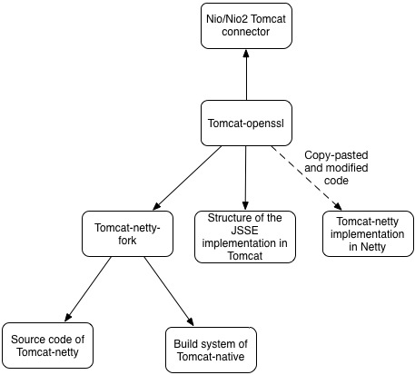
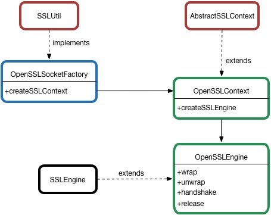

# OpenSSL for Tomcat
> Combine the power of OpenSSL with the Tomcat NIO/NIO2 connector

This project aims to provide better performances by using the OpenSSL library instead of the JSSE (Java Secure Socket Extension) API for the TLS encryption. Combined with the NIO/NIO2 connector, maintability will be easier compared to solutions using C sockets, like the APR connector.

With our project, a user can use the NIO or NIO2 connector and choose to use JSSE or OpenSSL for the TLS encryption. The only requirements is to have OpenSSL and our  [fork of tomcat-native](https://github.com/rmaucher/tomcat-native-openssl) instaled.

## Installation

This project will be soon integrated into Tomcat. But for now, you will need to build this project:

1. Clone [this project](https://github.com/facenord-sud/tomcat80-openssl)
2. Build it like the standard Tomcat project. Building instruction about how to buil Tomcat can be found [here](https://tomcat.apache.org/tomcat-8.0-doc/building.html). Basically, you need to copy `build.properties.default` to `build.properties`, edit it and run the command `ant deploy`
3. Clone our [forked Tomcat-native](https://github.com/rmaucher/tomcat-native-openssl) project, called tomcat-native-openssl
4. Built it like the normal tomcat-native project:
```bash
sh buildconf --with-apr=apr_source_location.
configure --with-apr=apr_install_location --with-ssl=openssl_install_location
make
```
5. In the file `$CATALINA_BASE/bin/setenv.sh` (create it if not exists) set the path to the builded tomcat-native-openssl library. For example, if the cloned tomcat-native-openssl project is located under `/Users/me/tomcat-native-openssl/` you need to add this line:
```bash
  CATALINA_OPTS="$CATALINA_OPTS -Djava.library.path=/Users/me/tomcat-native-openssl/native/.libs"
```

## Usage
First of all to use OpenSSL with NIO/NIO2 connectors, you need to have SSL certificates and keys. For testing, you can use the file `localhost-cert.pem` and `localhost-key.pem` generated for testing and located in [conf/](conf/).

After that you need to edit the file `$CATALINA_BASE/conf/server.xml` and add it a new connector using the NIO or NIO2 implementation and our OpenSSL implementation. It can be configured like this:
```xml
<Connector port="8443" protocol="org.apache.coyote.http11.Http11Nio2Protocol"
       SSLEnabled="true" scheme="https" secure="true"
       clientAuth="false" keystorePass="password"
       truststoreFile="conf/localhost-cert.pem"
       keystoreFile="conf/localhost-key.pem"
       sslImplementationName="ch.uninbf.mcs.tomcatopenssl.net.ssl.open.OpenSSLImplementation" />
```

Now, everything looks good and just do:
````
$CATALINE_BASE/bin/startup.sh
````
and browse to https://localhost:8443 !!!

## Results
We run extended benchmarks to measure the performance of this new TLS implementation. The benchhmarks matches the best possible expectations as we could see it above.



We can see here that our implementation (in red) is better than the two existing implementation in Tomcat (in violet and blue) and has the same performance of httpd of Apache. Notice that currently, when you use the NIO/NIO2 connector with the TLS encryption enabled you have performance approching the curve in violet. Our solution is a huge improvments compared to the JSSE implementation.



Again, our implementation is better than the two other implementation in Tomcat. But in this graph httpd requires still less CPU usage.

Tests have been performed with Tomcat running on a dedicated server (RHEL 6.4 2 x 10 G bounded boards / IBM x3650 / Intel Xeon 2.50 GHz  2 x4 cores cpu 6144 KB cache / Total:  8 cores.) and with 4 clients making 10 requests simultanesouly for a total concurrency of 40.

## How it works

### Overview


The image above shows how OpenSSL for Tomcat (Tomcat-openssl) is using code of different project and is integrated into Tomcat.
#### TLS encryption
For the TLS encryption, it uses a fork of the Tomcat-netty library. Basically the fork has the source code of tomcat-netty but the build system of tomcat-native, to avoid the use of Maven. Tomcat-netty, a fork of tomcat-native is a bind to the OpenSSL library to OpenSSL through the JNI(Java Native Interface).

#### Integration into NIO/NIO2 connector
Tomcat-openssl uses the same class structure as the JSSE implementation into Tomcat. It means that it extends and implements from the same classes and interfaces, which permits an easy integration in the NIO/NIO2 connector.

#### Tomcat-netty implementation
For the use of the tomcat-netty library, we did not need to reinvent the wheel. The netty project already provides an implementation and we ported the code from Netty to Tomcat. For example the classes OpenSslContext and SSLEngine are copied from the Netty project and adapted to the Tomcat strcuture and to use NIO/NIO2 for I/O operations.

### Details


The above image shows the most important part of the TLS implementation, the SSL context and the SSL engine. For brievty, this diagram is simplified and a lot of informations are omitted.

#### SSL context
The SSL context is represented in our implementation by the class `OpenSSLContext` The SSL context is responible of configuring ciphers suites, managing certificates, preparing and instantiating the SSL Engine, notably. It is created when Tomcat is starting up and intianited by the class `OpenSSLSocketFactory`.

#### SSL Engine
The SSL engine is responible of handsaking(key exchange), encrypting and uncrypting data with the client. In our implementation, it is represented by the class `OpenSSLEngine` and created and intiatied by the class `OpenSSLContext` at a new client connection. The methods `wrap()`/`unwrap()` are for encrypting/uncrypting data, `handshake()` for handshaking and `release()` when a connection is finished. All these methods are called by the class `SecureNIO2Channel` which is responible of manging communication with the client.

We can see that OpenSSLEngine extends from the class SSLEngine of the JSSE API. Doing like thihs provide compatibility with the JSSE implementation into Tomcat and our solution can be easily integrated into the NIO/NIO2 connector.

Colors:
* Green: Ported Netty's code
* Red: Tomcat's code
* Blue: Our code
* Black: Java standard language (here from the JSSE API)
